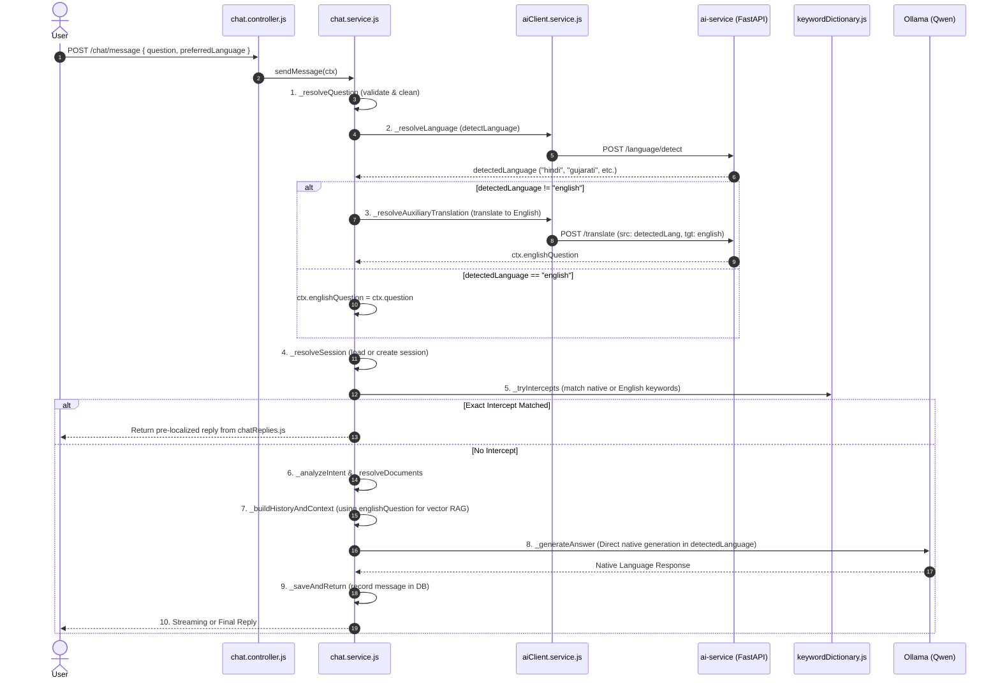

# Phase 1: Chatbot Pipeline Audit & Multilingual Translation Gateway - Research

**Researched:** 2026-09-22
**Domain:** Multilingual NLP, Query Normalization,Indic Language Translation, Express/Ollama Orchestration
**Confidence:** HIGH

<user_constraints>

## User Constraints (from CONTEXT.md)

### Locked Decisions

- **D-01 (Direct Native LLM Generation):** The LLM must answer directly in the user's detected language (`english`, `hindi`, `gujarati`, `marathi`, `tamil`) via prompt instructions. There is NO post-generation translation step for the AI model output.
- **D-02 (Pre-Localized Template Intercepts):** Deterministic intercepted replies (Profile, Age, Summaries, Reminders, Refills, Notifications) directly use the pre-localized i18n dictionaries in `src/constants/chatReplies.js` without translation hops.
- **D-03 (Multi-Language Keyword & Domain Matching):** Expand `keywordDictionary.js` to define comprehensive keywords across all 5 languages (English, Hindi, Gujarati, Marathi, Tamil) for each application domain, so queries in any supported language directly trigger their corresponding domain and database retrieval.
- **D-04 (Auxiliary Query Translation Fallback):** When a user asks in a non-English language and does not match exact vernacular keywords, an auxiliary internal translation produces `ctx.englishQuestion` for intent resolution and vector retrieval, but the final response generation remains native to the user's language.

### The Agent's Discretion

- Exact mapping structure between language codes (`hi`, `gu`, `mr`, `ta`, `en`) and full names (`hindi`, `gujarati`, `marathi`, `tamil`, `english`) in `src/utils/commonUtils.js:normalizeLanguage()`.
- Error handling, timeouts, and fallback resilience if language detection or translation microservice is slow or warming up.

### Deferred Ideas (OUT OF SCOPE)

- Voice-to-voice direct conversation (deferred to v2 milestone).
- Chat-based mutations / action execution (deferred to v2 milestone).
  </user_constraints>

<architectural_responsibility_map>

## Architectural Responsibility Map

| Capability                        | Primary Tier                         | Secondary Tier                           | Rationale                                                                                                  |
| --------------------------------- | ------------------------------------ | ---------------------------------------- | ---------------------------------------------------------------------------------------------------------- |
| Language Detection                | AI Service (`ai-service` FastAPI)    | Node.js Backend (`chat.service.js`)      | FastText/GlotLID runs in Python container; Node.js falls back to patient preferred language                |
| Auxiliary Query Translation       | AI Service (`ai-service` FastAPI)    | Node.js / Ollama (`aiClient.service.js`) | IndicTrans2 translates Indic -> English; Node.js LLM fallback ensures high availability                    |
| Keyword Dictionaries & Intercepts | Node.js Backend (`constants/`)       | —                                        | Pure in-memory dictionary lookups for sub-millisecond deterministic responses                              |
| Direct Native Response Generation | Node.js / Ollama (`chat.service.js`) | —                                        | Prompt directives enforce direct generation in detected language without secondary translation degradation |

</architectural_responsibility_map>

<research_summary>

## Summary

This research investigates the end-to-end request lifecycle within `src/services/ai/chat/chat.service.js` to establish an early multilingual gateway for the 5 supported languages (English, Hindi, Gujarati, Marathi, Tamil). Currently, the 10-step pipeline in `chat.service.js` executes `_resolveQuestion()` before `_resolveLanguage()`, leaving `ctx.question` untranslated when `_tryIntercepts()` and `detectContextGraph()` evaluate domain matches.

Furthermore, `src/constants/keywordDictionary.js` contains English and Gujarati keywords, but has major omissions for Hindi, Marathi, and Tamil (including mislabeled sections where Gujarati characters were placed under Hindi/Marathi comments).

The recommended approach establishes a clean 3-part Phase 1 implementation:

1. **Early Language Resolution & Auxiliary Translation**: In `chat.service.js`, resolve user language immediately, and if `detectedLanguage !== "english"`, produce `ctx.englishQuestion` via `aiClient.translate(question, detectedLanguage, "english")` while preserving `ctx.question` (raw) and `ctx.detectedLanguage`.
2. **Standardized Normalization**: Update `src/utils/commonUtils.js:normalizeLanguage()` and `src/services/ai/clients/aiClient.service.js:_translateWithLlm()` to support full bidirectional mapping for English, Hindi, Gujarati, Marathi, and Tamil.
3. **Comprehensive 5-Language Keyword Dictionaries**: Expand `src/constants/keywordDictionary.js` so native vernacular queries in Hindi, Gujarati, Marathi, and Tamil directly match target domains without requiring translation overhead.

**Primary recommendation:** Resolve language before intent evaluation in `chat.service.js`, generate `ctx.englishQuestion` as an auxiliary property for vector search and intent classification, expand `keywordDictionary.js` across all 5 languages, and maintain direct native LLM generation.
</research_summary>

<standard_stack>

## Standard Stack

### Core

| Library / Component    | Version / Location         | Purpose                          | Why Standard                                                                    |
| ---------------------- | -------------------------- | -------------------------------- | ------------------------------------------------------------------------------- |
| `chat.service.js`      | `src/services/ai/chat/`    | 10-step Chat coordinator         | Central orchestration point for sessions, intercepts, retrieval, and generation |
| `aiClient.service.js`  | `src/services/ai/clients/` | Translation & detection wrapper  | Provides IndicTrans2 integration with automatic Ollama LLM fallback             |
| `ai-service`           | Python FastAPI (`:8000`)   | IndicTrans2 & GlotLID service    | High-precision Indic language translation and script detection                  |
| `keywordDictionary.js` | `src/constants/`           | Domain keyword registries        | Fast, deterministic regex/substring matching across application domains         |
| `chatReplies.js`       | `src/constants/`           | Pre-localized response templates | Zero-latency i18n messages across English, Gujarati, Hindi, Marathi, Tamil      |

### Supporting

| Component                      | Location                     | Purpose                                                             |
| ------------------------------ | ---------------------------- | ------------------------------------------------------------------- |
| `normalizeLanguage`            | `src/utils/commonUtils.js`   | Normalizes language aliases (`en`, `hi`, `gu`, `mr`, `ta`)          |
| `STRICT_LANGUAGE_INSTRUCTIONS` | `src/services/ai/prompts.js` | System prompt directives enforcing direct native language answering |

</standard_stack>

<architecture_patterns>

## Architecture Patterns

### 10-Step Chat Lifecycle Flow



### Pattern 1: Early Auxiliary Translation Guard

In `chat.service.js`, auxiliary translation should only run when needed and must fail open (preserving original question if translation fails):

```javascript
// Step in chat.service.js
async _resolveLanguageAndTranslation(ctx) {
  await this._resolveLanguage(ctx);

  const { question, detectedLanguage } = ctx;
  ctx.rawQuestion = question;
  ctx.englishQuestion = question;

  if (detectedLanguage && detectedLanguage !== "english") {
    try {
      const transStartTime = Date.now();
      const translated = await aiClient.translate(question, detectedLanguage, "english");
      if (translated && translated.trim()) {
        ctx.englishQuestion = translated.trim();
        debugLogger.info(`sendMessage: [AUXILIARY TRANSLATION] took ${Date.now() - transStartTime}ms`, {
          original: question,
          english: ctx.englishQuestion,
          language: detectedLanguage,
        });
      }
    } catch (err) {
      debugLogger.warn("sendMessage: Auxiliary query translation failed, using raw question", {
        error: err.message,
      });
      ctx.englishQuestion = question;
    }
  }

  ctx.cleanEnglishQuestion = ctx.englishQuestion.toLowerCase().replace(/[?.]/g, "").trim();
  // Retrieval queries for vector embeddings and document entities should use englishQuestion
  ctx.retrievalQuery = ctx.englishQuestion;
}
```

### Pattern 2: Bidirectional Language Normalization

In `src/utils/commonUtils.js`, `normalizeLanguage` must support both 2-letter codes, 3-letter codes, and full English names for all 5 languages:

```javascript
function normalizeLanguage(lang) {
  if (!lang) return "english";
  const clean = String(lang).toLowerCase().trim();
  if (clean === "en" || clean === "eng" || clean === "english") return "english";
  if (clean === "gu" || clean === "guj" || clean === "gujarati") return "gujarati";
  if (clean === "hi" || clean === "hin" || clean === "hindi") return "hindi";
  if (clean === "mr" || clean === "mar" || clean === "marathi") return "marathi";
  if (clean === "ta" || clean === "tam" || clean === "tamil") return "tamil";

  const valid = ["english", "gujarati", "hindi", "marathi", "tamil"];
  if (valid.includes(clean)) return clean;
  return "english";
}
```

### Pattern 3: Direct Native LLM Prompting

Ensure that whenever `_generateAnswer` calls `qwenHealthChat`, the prompt injects the verified `STRICT_LANGUAGE_INSTRUCTIONS[detectedLanguage]`:

```javascript
_appendLanguageInstruction(systemPrompt, normLang) {
  const instructionContent = pickLang(prompts.STRICT_LANGUAGE_INSTRUCTIONS, normLang);
  return `${systemPrompt}\n\n${instructionContent}`;
}
```

This avoids any post-generation translation degradation (as required by decision `D-01`).
</architecture_patterns>

<pitfalls_and_mitigations>

## Pitfalls & Mitigations

### Pitfall 1: IndicTrans2 Translation Latency on Simple Queries

- **Risk:** Calling external translation on every non-English message adds 300-800ms of latency.
- **Mitigation:** Comprehensive keyword expansion in `keywordDictionary.js` allows deterministic intercepts (Profile, Age, Summaries, Reminders, Refills, Notifications) to fire immediately without waiting for translation.

### Pitfall 2: LLM Translation Fallback English Target Mismatch

- **Risk:** In `src/services/ai/clients/aiClient.service.js:_translateWithLlm()`, `targetLangName` only had checks for `gu`, `hi`, `mr`, `ta` and defaulted to `tgtLang`. When translating to English (`tgtLang: "english"`), the prompt header referred to medical report translation rather than user query translation.
- **Mitigation:** Standardize `_translateWithLlm` so `tgtLang === "english" || tgtLang === "en"` maps `targetLangName = "English"`, and adapt prompt instructions to handle general user queries and health questions gracefully.

### Pitfall 3: Inconsistent Language Fallback in Intercepts

- **Risk:** In `chat.service.js:_tryIntercepts()`, several template responses (e.g. `NO_REPORT_FOUND_I18N`, `REPORT_PROCESSING_I18N`) used `patientPreferredLang` instead of `detectedLanguage`, resulting in English replies when an English-profile user asked a question in Hindi or Gujarati.
- **Mitigation:** Ensure all intercepted replies uniformly use `detectedLanguage` (resolved from the current query).
  </pitfalls_and_mitigations>

<validation_architecture>

## Validation Architecture

### Automated Tests

1. **Unit Tests for Language Normalization (`tests/unit/commonUtils.test.js`)**:
   - Verify `normalizeLanguage` correctly handles `["en", "eng", "english", "hi", "hin", "hindi", "gu", "guj", "gujarati", "mr", "mar", "marathi", "ta", "tam", "tamil"]` and invalid inputs fallback to `"english"`.
2. **Unit Tests for Early Query Translation (`tests/unit/chatTranslationGateway.test.js`)**:
   - Mock `aiClient.detectLanguage` and `aiClient.translate`.
   - Test that Hindi, Gujarati, Marathi, and Tamil questions produce `ctx.englishQuestion` while preserving `ctx.question`.
   - Test that translation failure falls back to `ctx.englishQuestion = ctx.question` without throwing an uncaught exception.
3. **Keyword Dictionary Verification (`tests/unit/keywordDictionary.test.js`)**:
   - Verify that domain keywords (`PROFILE`, `MEDICATION`, `REMINDER`, `REFILL`, `NOTIFICATION`, `DOCUMENT`) contain valid entries for all 5 languages without script mislabeling.

### Manual Verification Steps

- Send test questions in Hindi (e.g. "मेरी उम्र क्या है?", "मेरी दवाइयाँ दिखाओ"), Gujarati ("મારી ઉંમર કેટલી છે?"), Marathi ("माझे वय किती आहे?"), and Tamil ("என் வயது என்ன?").
- Verify that intercepted responses return the expected pre-localized text from `chatReplies.js` in the matching language without translation artifacts.
  </validation_architecture>
