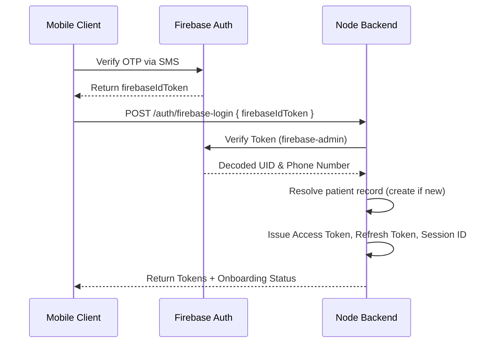

# AGENT.md

## 1. Project Overview

**Health Vault** is a secure, AI-powered healthcare portal designed to manage patient records, extract structured medical data from uploads, orchestrate medication schedules, and facilitate contextual RAG (Retrieval-Augmented Generation) health chats. The system supports multi-device session mapping, push notifications, and a bilingual onboarding process (English and Gujarati).

---

## 1.5 Agent Operating Rules (READ BEFORE ANY TASK)

### Before writing code

- ALWAYS read the existing folder structure (Section 3) and schema (Section 4) first.
- Before adding a model field, service, repository, controller, util, enum, or
  validation: SEARCH the codebase for an existing one and REUSE it. Do not create
  a duplicate.
- If a similar service/repository exists, EXTEND it — do not create a parallel one.

### Scope discipline

- Implement ONLY what the prompt asks. No speculative features, no refactors,
  no "nice to have" extras, no unused code, no commented-out blocks.
- One feature/task per change. Do not touch unrelated files.

### File & language (NON-NEGOTIABLE)

- This project uses JavaScript with CommonJS (require / module.exports).
- NEVER create .ts / .tsx files. Use .js only. No TypeScript type annotations.

### Plan first

- For any non-trivial task, first output a short plan: which existing files/
  models/services you will reuse and what you will add. WAIT for confirmation
  before writing code.

### Verify before finishing

- Trace the requested use case end-to-end through the real layers
  (route -> controller -> validation -> service -> repository -> model).
- Run `npm run test:unit` (and `npm run test:ocr` if OCR is touched) and fix failures.
- Confirm migrations are generated when schema changes (Section 9).

---

## 2. Tech Stack

- **Core Runtime**: Node.js (v22/v23) using the native `--experimental-strip-types` flag to run TypeScript syntax.
- **Server Framework**: Express.js.
- **Database ORM**: Drizzle ORM.
- **Database Driver**: `pg` (PostgreSQL client pool).
- **Database Extensions**: `pgvector` (for vector embeddings and semantic similarity searches).
- **Authentication**: Firebase Admin SDK (Mobile OTP Verification) and custom JSON Web Tokens (JWT).
- **External AI Integrations**: Google GenAI, Local Ollama (`qwen3:32b`), and Python FastAPI AI Service.
- **Storage**: Multer for handling file uploads; local storage, AWS S3, or GCP Cloud Storage for document persistence.
- **OCR Engine**: Tesseract.js (Node-level) and Qwen Vision/Ollama (Service-level).

---

## 3. Folder Structure

```text
health-vault-backend/
├── ai-service/             # Python FastAPI service providing AI, OCR, Embeddings, RAG, and Voice endpoints
├── drizzle/                # Database migrations generated by Drizzle Kit
├── src/
│   ├── configs/            # Configuration loaders (env, database pool, firebase, security, swagger)
│   ├── constants/          # Application constants (error/message constants, api endpoints)
│   ├── controllers/        # Express request handler controllers (patients, medications, RAG/onboarding v1)
│   ├── enums/              # Shared enums (userStatus, genderType, fileType, ocrStatus, foodType)
│   ├── exceptions/         # Custom Application exception wrappers (AppError, NotFoundException, etc.)
│   ├── helpers/            # HTTP responses formatting helpers
│   ├── jobs/               # Scheduled cron tasks (medication alerts, overdue events)
│   ├── middlewares/        # Express middleware chain (auth verification, file uploads, error handlers)
│   ├── models/             # Drizzle PostgreSQL Table Schemas (patients, documents, medications, sessions)
│   ├── prompt/             # Raw text templates for AI prompts
│   ├── repositories/       # Encapsulated database query repository classes
│   ├── routes/             # Express routes mount configurations
│   ├── services/           # Business logic layer (medications, document processing, SSE)
│   │   └── ai/             # AI core services (onboarding state machine, chatbot, RAG, Qwen Vision)
│   ├── utils/              # Common utility functions (token hashing, patient code generator, JWT helpers)
│   ├── validations/        # Zod input validation schemas
│   └── server.js           # Server entry point
├── tests/                  # Jest test suite (unit and integration tests)
├── Dockerfile              # Production Node container definition
└── docker-compose.yml      # DB (pgvector) and ai-service container orchestration mapping
```

---

## 4. Database Schema Summary

> AGENT RULE: This schema is the single source of truth. Do NOT add a new column
> if an equivalent already exists (e.g. `softDelete` already handles deletions —
> never add `isDeleted`/`deleted_at`). Reuse existing columns, enums, and FKs.
> Any schema change MUST go through Drizzle migrations (Section 9), never ad-hoc.

### `patients` (Table: `patients`)

- `id` (UUID): Primary key, default random.
- `patientCode` (VARCHAR): Unique numeric patient code (generated).
- `userName` (VARCHAR): Cleaned fallback username.
- `firstName`, `lastName`, `fullName` (VARCHAR): Patient names.
- `email` (VARCHAR): Unique.
- `password` (VARCHAR): Hashed password.
- `status` (ENUM): `ACTIVE`, `INACTIVE`, `BLOCKED`.
- `loginAttempts` (INTEGER): Default 0.
- `blockedAt` (TIMESTAMP).
- `otp`, `otpSendDateTime`, `otpExpiredDateTime` (TIMESTAMP/VARCHAR).
- `isVerified` (BOOLEAN): Mobile OTP verified status.
- `gender` (ENUM): `male`, `female`.
- `mobile`, `countryCode`, `firebaseUid` (VARCHAR).
- `dateOfBirth` (DATE).
- `profileImageKey` (TEXT).
- `bloodGroup` (VARCHAR).
- `allergies` (TEXT[]).
- `softDelete` (BOOLEAN): Default `false`.

### `sessions` (Table: `sessions`)

- `id` (UUID): Primary key, maps to session tokens.
- `userId` (UUID): Foreign key references `patients.id` (cascade).
- `refreshTokenHash` (VARCHAR): Hashed refresh token.
- `refreshTokenExpiresAt` (TIMESTAMP).
- `deviceToken` (VARCHAR): Target token for push alerts.
- `isActive` (BOOLEAN): Default `true`.

### `documents` (Table: `documents`)

- `id` (UUID): Primary key.
- `userId` (UUID): References `patients.id`.
- `documentType` (ENUM): `medical_document`, etc.
- `fileName` (VARCHAR), `filePath` (TEXT), `s3Bucket` (VARCHAR), `s3Key` (VARCHAR).
- `fileSize` (INTEGER), `fileType` (ENUM).
- `ocrStatus` (ENUM): `PENDING`, `PROCESSING`, `COMPLETED`, `FAILED`.
- `ocrExtractedText` (TEXT).
- `structuredExtractedData` (JSONB).
- `reportDate` (DATE), `hospitalName` (VARCHAR), `doctorName` (VARCHAR), `remarks` (TEXT), `summaryGujarati` (TEXT).

### `structured_documents` (Table: `structured_documents`)

- Normalized OCR + entity extraction output mapping section pages, lab results, confidence scores, and structured JSON structures back to `documents`.

### `document_chunks` (Table: `document_chunks`)

- Text snippets used to feed vector storage. Contains token estimates, index orders, and sourceType.

### `embeddings` (Table: `embeddings`)

- `embedding` (VECTOR): 768-dimension vectors representing chunk semantics. Matches chunk IDs.

### `medical_entities` (Table: `medical_entities`)

- Typed entities like medicines, dosages, test values, and disease tags.

### `chat_sessions` & `chat_messages` (Tables: `chat_sessions`, `chat_messages`)

- Session threads and cursor-paginated messages tracking user and assistant conversations.

### `medications` (Table: `medications`)

- Prescription entries containing ongoing status, quantities, times, schedules, and refill warnings.

### `medication_reminders` & `medication_reminder_occurrences`

- Generated occurrences tracking dosage intake statuses: `PENDING`, `TAKEN`, `SKIPPED`.

---

## 5. API Architecture

The Express API utilizes a modular routing architecture:

- `/auth`: Handles authentication (`/firebase-login`, `/refresh-token`, `/logout`).
- `/patient`: Retrieves and updates patient profiles.
- `/documents`: Document uploads and retrieval.
- `/medications` & `/medication-reminders`: Reminders scheduling and compliance logging.
- `/chat`: Conversation threads.
- `/v1`: Contains the AI routes:
  - `POST /v1/ocr-extract`: Uploads documents, performs OCR, extracts structured data, summaries, and indexes to RAG.
  - `POST /v1/chat`: Document Q&A.
  - `POST /v1/onboarding-chat`: Orchestrates deterministic state-machine onboarding.

---

## 6. Authentication Flow



- **Session Expiration / 401 Interception**: The mobile client interceptor automatically intercepts `401` errors containing `SESSION_EXPIRED` or `forceLogout: true` and logs out the client.
- **Auth Endpoint Bypass**: Routes like `/auth/firebase-login` are explicitly bypassed from force-logout cancellation in the frontend to avoid deadlock blocks when logging in again.

---

## 7. Coding Standards

- **Modules**: CommonJS (`require`/`module.exports`).
- **Architecture**: Decoupled layers following Clean Architecture concepts:
  - **Controllers**: Parse input, validate payloads using Zod, delegate to Services, format responses.
  - **Services**: Execute domain logic and business rule sets.
  - **Repositories**: Execute database queries using Drizzle ORM wrappers.
  - **Models**: Declare schemas and table fields.
- **Validations**: Strict request validation using Zod.
- **Formatting**: Prettier configuration with trailing commas, double quotes, and semicolons.
- **Layer boundaries (enforced)**: Controllers never query the DB directly —
  they call Services; Services call Repositories; Repositories use Drizzle.
  Never bypass a layer or duplicate logic across layers.
- **Reuse first**: New business logic belongs in an EXISTING service when one
  fits (e.g. medication logic -> existing medications service). Create a new
  service only if no existing one is responsible for that domain.
- **No duplicate utils**: Check `src/utils/` (commonUtils.js, jwtUtils.js) before
  writing helpers like hashing, patient codes, or JWT — reuse them.

---

## 8. Environment Variables

- `PORT`: Server port (default `3000`).
- `DATABASE_URL`: Connection string for PostgreSQL database.
- `JWT_SECRET`: Secret key for signing Access Tokens.
- `JWT_ACCESS_EXPIRES_IN` / `JWT_REFRESH_EXPIRES_IN`: Expiry intervals (default `15m` / `7d`).
- `STORAGE_PROVIDER`: File storage target (`s3` or `gcp`).
- `FIREBASE_PROJECT_ID` / `FIREBASE_CREDENTIALS_BASE64`: Firebase admin configuration keys.
- `AI_BASE_URL` / `AI_MODEL`: Target Ollama API base and target model name (e.g. `qwen3:32b`).
- `MAX_LOGIN_ATTEMPTS`: Lockout limit (default `3`).

---

## 9. Build and Run Commands

### Database Migrations

```bash
# Generate migration files based on schema changes
npm run db:generate

# Apply migrations to database
npm run db:migrate

# Push local schemas to database directly
npm run db:push
```

### Run Locally

```bash
# Run server with hot reload and TypeScript stripping
npm run dev

# Run in production mode
npm start
```

### Testing

```bash
# Run Jest unit/integration tests
npm run test:unit

# Run OCR tests only
npm run test:ocr
```

### Definition of Done (agent must satisfy)

1. Code compiles and `npm run dev` starts with no errors.
2. `npm run test:unit` passes (plus `npm run test:ocr` if OCR changed).
3. Schema changes have a generated migration via `npm run db:generate`.
4. The target use case is traced end-to-end and confirmed working.
5. No new .ts files, no unused/extra code.

---

## 10. Important Business Rules

> AGENT RULE: NEVER let the LLM decide onboarding step transitions. Steps are
> fixed in the backend state engine. The LLM only extracts/cleans/translates
> values for the current step. Do not add dynamic branching driven by LLM output.

- **Deterministic AI Onboarding**: Onboarding follows a strict backend-defined step sequence:
  `ASK_LANGUAGE` -> `ASK_UPLOAD_OR_SKIP` -> `ASK_UPLOAD_DOCUMENT` -> `ASK_DOCUMENT_CONFIRMATION` -> `ASK_FIRST_NAME` -> `ASK_LAST_NAME` -> `ASK_DOB` -> `ASK_GENDER` -> `ASK_BLOOD_GROUP` -> `ASK_ALLERGIES` -> `REGISTER_USER` -> `COMPLETE`.
- **AI Onboarding Boundary**: The LLM is used **strictly** to extract details, parse languages, and clean unstructured responses. The step transitions are strictly written in the backend state engine and _never_ decided dynamically by the LLM context.
- **Name Transliteration**: Non-English names provided in Gujarati must be translated or transliterated to English format.
- **Deletions**: Document, patient, session, and medication deletions are handled via `soft_delete` markers to preserve compliance and history.

---

## 11. Common Utilities

- `commonUtils.js`: Contains `generateNumericPatientCode`, `hashToken` (for refresh tokens), and `sanitizePatient`.
- `jwtUtils.js`: Wraps jsonwebtoken for generating/validating access tokens and refresh tokens.

---

## 12. AI Development Guidelines

- **Ollama/GenAI Reliability**: Always configure request retries and fallback to alternative models/endpoints if Ollama fails or times out.
- **JSON Output Mode**: Force JSON outputs by providing structured system instructions and validating output structures via `cleanAndParseJson`.
- **Prompt Isolation**: System instructions must remain decoupled from business rules; keep templates defined inside template files.
