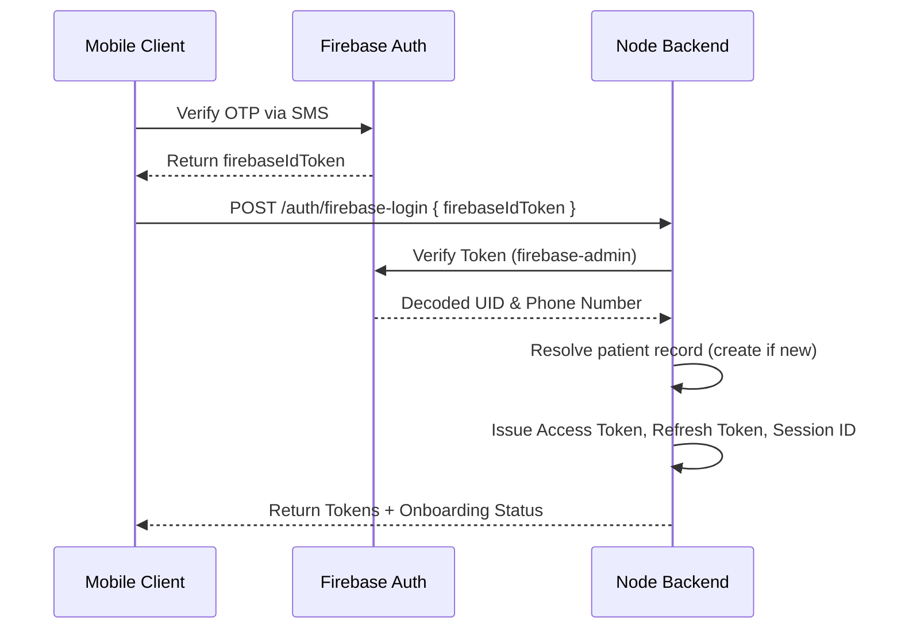

# AGENTS.md

> **Rule precedence:** When any guidance conflicts, **Section 1.5 (Agent Operating Rules) wins.**

## 1. Project Overview

**Health Vault** is a secure, AI-powered healthcare portal designed to manage patient records, extract structured medical data from uploads, orchestrate medication schedules, and facilitate contextual RAG (Retrieval-Augmented Generation) health chats. The system supports multi-device session mapping, push notifications, and a bilingual onboarding process (English and Gujarati).

---

## 1.5 Agent Operating Rules (READ BEFORE ANY TASK)

### Before writing code

- ALWAYS read the existing folder structure (Section 3) and schema (Section 4) first.
- Before adding a model field, service, repository, controller, util, enum, or validation: SEARCH the codebase for an existing one and REUSE it. Do not create a duplicate.
- If a similar service/repository exists, EXTEND it — do not create a parallel one.

### Scope discipline

- Implement ONLY what the prompt asks. No speculative features, no refactors, no "nice to have" extras, no unused code, no commented-out blocks.
- One feature/task per change. Do not touch unrelated files.

### File & language (NON-NEGOTIABLE)

- This project uses **JavaScript with CommonJS** (`require` / `module.exports`).
- **NEVER create `.ts` / `.tsx` files. Write `.js` only. No TypeScript type annotations.**
- Do not add TypeScript syntax to files. (The runtime is capable of stripping types, but this project intentionally does NOT use it — plain JS only.)

### Non-negotiable code rules (apply to EVERY change)

1. **No inline imports.** NEVER write `require` / `import` inside a function, method, or class — all imports live at the TOP of the file. If hoisting causes a circular dependency, FIX the cycle instead of lazy-loading (see Section 7).
2. **Messages come from constants.** All response/error messages MUST come from `messageConstants` / `errorConstants` in `src/constants/`. Never hardcode a message inline and never use `CONSTANT || "fallback"`. Add a new constant if one is missing (see Section 7).
3. **Typed values are enums.** Any field with a fixed set of values (gender, status, file type, OCR status, etc.) MUST be an enum in `src/enums/` and imported — never inline arrays or magic strings like `["male", "female"]`. Enum values MUST match the DB schema (see Section 7).
4. **Zod validates every request.** Every request carrying input (body / params / query) MUST have a Zod schema in `src/validations/`, run as middleware BEFORE the controller (see Section 7).

### Plan first

- For any non-trivial task, first output a short plan: which existing files/models/services you will reuse and what you will add. WAIT for confirmation before writing code.

### Verify before finishing

- Trace the requested use case end-to-end through the real layers (route → validation → controller → service → repository → model).
- Run `npm run test:unit` (and `npm run test:ocr` if OCR is touched) and fix failures.
- Confirm migrations are generated when schema changes (Section 9).
- Update Swagger docs whenever a route is added, removed, or its method/path/params/request/response change (Section 13). No route change is complete without its matching spec.

---

## 2. Tech Stack

- **Core Runtime**: Node.js (v22/v23), CommonJS modules. Source is plain JavaScript (`.js`) only — no TypeScript.
- **Server Framework**: Express.js.
- **Database ORM**: Drizzle ORM.
- **Database Driver**: `pg` (PostgreSQL client pool).
- **Database Extensions**: `pgvector` (for vector embeddings and semantic similarity searches).
- **Authentication**: Firebase Admin SDK (Mobile OTP Verification) and custom JSON Web Tokens (JWT).
- **External AI Integrations**: Google GenAI, Local Ollama (`qwen3:32b`), and Python FastAPI AI Service.
- **Storage**: Multer for handling file uploads; local storage, AWS S3, or GCP Cloud Storage for document persistence.
- **OCR Engine**: Tesseract.js (Node-level) and Qwen Vision/Ollama (Service-level).

---

## 3. Folder Structure

```text
health-vault-backend/
├── ai-service/             # Python FastAPI service providing AI, OCR, Embeddings, RAG, and Voice endpoints
├── drizzle/                # Database migrations generated by Drizzle Kit
├── src/
│   ├── configs/            # Configuration loaders (env, database pool, firebase, security, swagger)
│   ├── constants/          # Application constants (error/message constants, api endpoints)
│   ├── controllers/        # Express request handler controllers (patients, medications, RAG/onboarding v1)
│   ├── enums/              # Shared enums (userStatus, genderType, fileType, ocrStatus, foodType)
│   ├── exceptions/         # Custom Application exception wrappers (AppError, NotFoundException, etc.)
│   ├── helpers/            # HTTP response formatting helpers
│   ├── jobs/               # Scheduled cron tasks (medication alerts, overdue events)
│   ├── middlewares/        # Express middleware chain (auth verification, file uploads, validation, error handlers)
│   ├── models/             # Drizzle PostgreSQL Table Schemas (patients, documents, medications, sessions)
│   ├── prompt/             # Raw text templates for AI prompts
│   ├── repositories/       # Encapsulated database query repositories
│   ├── routes/             # Express routes mount configurations
│   ├── services/           # Business logic layer (medications, document processing, SSE)
│   │   └── ai/             # AI core services (onboarding state machine, chatbot, RAG, Qwen Vision)
│   ├── utils/              # Common utility functions (token hashing, patient code generator, JWT helpers)
│   ├── validations/        # Zod input validation schemas
│   └── server.js           # Server entry point
├── tests/                  # Jest test suite (unit and integration tests)
├── Dockerfile              # Production Node container definition
└── docker-compose.yml      # DB (pgvector) and ai-service container orchestration mapping
```

### File naming convention (STRICT)

- Use dot notation, with the SAME `<name>` across all layers for one resource:
  - `<name>.controller.js` (e.g. `session.controller.js`)
  - `<name>.service.js` (e.g. `session.service.js`)
  - `<name>.repository.js` (e.g. `session.repository.js`)
  - `<name>.validation.js` (e.g. `session.validation.js`)
- Do NOT use other styles: no `sessionController.js`, no `session_controller.js`.
- **Note:** the folder is `validations/` (plural) but each file is `.validation.js` (singular). This is intentional — do not "fix" one to match the other.

---

## 4. Database Schema Summary

> **AGENT RULE:** This schema is the single source of truth. Do NOT add a new column if an equivalent already exists (e.g. `softDelete` already handles deletions — never add `isDeleted`/`deleted_at`). Reuse existing columns, enums, and FKs. Any schema change MUST go through Drizzle migrations (Section 9), never ad-hoc.

### `patients` (Table: `patients`)

- `id` (UUID): Primary key, default random.
- `patientCode` (VARCHAR): Unique numeric patient code (generated).
- `userName` (VARCHAR): Cleaned fallback username.
- `firstName`, `lastName`, `fullName` (VARCHAR): Patient names.
- `email` (VARCHAR): Unique.
- `password` (VARCHAR): Hashed password.
- `status` (ENUM): `ACTIVE`, `INACTIVE`, `BLOCKED`.
- `loginAttempts` (INTEGER): Default 0.
- `blockedAt` (TIMESTAMP).
- `otp`, `otpSendDateTime`, `otpExpiredDateTime` (TIMESTAMP/VARCHAR).
- `isVerified` (BOOLEAN): Mobile OTP verified status.
- `gender` (ENUM): `male`, `female`.
- `mobile`, `countryCode`, `firebaseUid` (VARCHAR).
- `dateOfBirth` (DATE).
- `profileImageKey` (TEXT).
- `bloodGroup` (VARCHAR).
- `allergies` (TEXT[]).
- `softDelete` (BOOLEAN): Default `false`.

### `sessions` (Table: `sessions`)

- `id` (UUID): Primary key, maps to session tokens.
- `userId` (UUID): Foreign key references `patients.id` (cascade).
- `refreshTokenHash` (VARCHAR): Hashed refresh token.
- `refreshTokenExpiresAt` (TIMESTAMP).
- `deviceToken` (VARCHAR): Target token for push alerts.
- `isActive` (BOOLEAN): Default `true`.

### `documents` (Table: `documents`)

- `id` (UUID): Primary key.
- `userId` (UUID): References `patients.id`.
- `documentType` (ENUM): `medical_document`, etc.
- `fileName` (VARCHAR), `filePath` (TEXT), `s3Bucket` (VARCHAR), `s3Key` (VARCHAR).
- `fileSize` (INTEGER), `fileType` (ENUM).
- `ocrStatus` (ENUM): `PENDING`, `PROCESSING`, `COMPLETED`, `FAILED`.
- `ocrExtractedText` (TEXT).
- `structuredExtractedData` (JSONB).
- `reportDate` (DATE), `hospitalName` (VARCHAR), `doctorName` (VARCHAR), `remarks` (TEXT), `summaryGujarati` (TEXT).

### `structured_documents` (Table: `structured_documents`)

- Normalized OCR + entity extraction output mapping section pages, lab results, confidence scores, and structured JSON structures back to `documents`.

### `document_chunks` (Table: `document_chunks`)

- Text snippets used to feed vector storage. Contains token estimates, index orders, and sourceType.

### `embeddings` (Table: `embeddings`)

- `embedding` (VECTOR): 768-dimension vectors representing chunk semantics. Matches chunk IDs.

### `medical_entities` (Table: `medical_entities`)

- Typed entities like medicines, dosages, test values, and disease tags.

### `chat_sessions` & `chat_messages` (Tables: `chat_sessions`, `chat_messages`)

- Session threads and cursor-paginated messages tracking user and assistant conversations.

### `medications` (Table: `medications`)

- Prescription entries containing ongoing status, quantities, times, schedules, and refill warnings.

### `medication_reminders` & `medication_reminder_occurrences`

- Generated occurrences tracking dosage intake statuses: `PENDING`, `TAKEN`, `SKIPPED`.

---

## 5. API Architecture

The Express API utilizes a modular routing architecture:

- `/auth`: Handles authentication (`/firebase-login`, `/refresh-token`, `/logout`).
- `/patient`: Retrieves and updates patient profiles.
- `/documents`: Document uploads and retrieval.
- `/medications` & `/medication-reminders`: Reminders scheduling and compliance logging.
- `/chat`: Conversation threads.
- `/v1`: Contains the AI routes:
  - `POST /v1/ocr-extract`: Uploads documents, performs OCR, extracts structured data, summaries, and indexes to RAG.
  - `POST /v1/chat`: Document Q&A.
  - `POST /v1/onboarding-chat`: Orchestrates deterministic state-machine onboarding.

---

## 6. Authentication Flow



- **Session Expiration / 401 Interception**: The mobile client interceptor automatically intercepts `401` errors containing `SESSION_EXPIRED` or `forceLogout: true` and logs out the client.
- **Auth Endpoint Bypass**: Routes like `/auth/firebase-login` are explicitly bypassed from force-logout cancellation in the frontend to avoid deadlock blocks when logging in again.

---

## 7. Coding Standards

### Modules & language

- CommonJS (`require` / `module.exports`). Plain JavaScript (`.js`) only — no TypeScript.
- **All `require()` / imports go at the TOP of the file. NEVER put `require` / `import` inside a function, method, class, or any block.** No in-method/inline requires. No duplicate requires — reuse the existing top-level import if the module is already required.
  - **Circular dependencies:** if moving a `require` to the top creates a circular dependency, FIX the cycle (extract the shared code into a separate module that both files import) — do NOT lazy-load inside a method to hide it. Only as a genuine last resort may a `require` stay inside a function, and then it MUST carry an inline comment explaining the specific circular dependency.

### Architecture — decoupled layers (Clean Architecture)

Layer flow, enforced strictly:

```
Route → Validation (Zod middleware) → Controller → Service → Repository → Model (Drizzle) → DB
```

Each layer may only call the layer directly below it. Never skip a layer, never call upward, never duplicate logic across layers.

- **Validation** (`src/validations/<name>.validation.js`, Zod):
  - **Every request that carries input (body, params, or query) MUST have a Zod schema and be validated — no route with input may skip validation.**
  - Define Zod schemas for request body/params/query.
  - Runs as **route middleware BEFORE the controller**. Controllers consume already-validated input and must NOT re-validate raw request shape.
  - Validate enum-typed fields against the shared enums in `src/enums/` (see "Typed values (enums)" below), not against inline value lists.
  - No business logic, no DB access, no service/repository calls.
  - **File uploads:** mimetype allowlists, size limits, file-count limits, and required-file checks MUST be validated in middleware — via the multer config (`fileFilter` + `limits`) or a dedicated upload-validation middleware in `src/middlewares/` — NEVER inside controllers or services. Allowed mime types and size/count limits live in `constants/` or `configs/`; never hardcode them inline.
  - **No request-shape normalization outside middleware:** controllers must NOT parse or normalize `req.files` / `req.body` shapes (e.g. array-vs-object juggling like `req.files.file || req.files.files`). Normalize in middleware so the controller receives ready-to-use input.
- **Controllers** (`src/controllers/<name>.controller.js`, THIN):
  - Read already-validated input from `req`, call **exactly one** service method, and return via the response helper.
  - No business logic, no calculations, no domain conditionals, no direct DB/repository access.
  - **Call exactly ONE service method.** Any workflow that touches multiple services/repositories (e.g. upload → object storage → OCR job creation) must be orchestrated INSIDE a single service method, never chained in the controller. The controller must not build/transform response payloads (loops, shaping `{ jobs, count }`, etc.) — the service returns ready data.
- **Services** (`src/services/<name>.service.js` — business logic ONLY):
  - All domain logic, decisions, calculations, orchestration, and data transformation.
  - Compose one or more repository calls. Enforce domain rules and throw domain errors via the exception wrappers.
  - No raw DB/ORM/model calls — always go through a repository. No `req`/`res`; take plain arguments, return plain data (never touch HTTP).
- **Repositories** (`src/repositories/<name>.repository.js` — CRUD/DB ONLY):
  - Pure database operations via Drizzle (create, read, update, delete, queries, aggregations). Return raw data/entities.
  - Use the functional `module.exports = { ... }` style (consistent with controllers/services). No business logic, no `req`/`res`, no HTTP status codes.
- **Models** (`src/models/`): Declare Drizzle schemas and table fields only.

### Responses & errors

- Always return via the standard response helpers (`successResponse` / error helper) in `src/helpers/`, with the correct `StatusCodes` and `messageConstants`.
- Services throw domain errors via the exception wrappers (`AppError`, `NotFoundException`, etc.) in `src/exceptions/`; a service must never return `res` directly.
- **All user-facing / response / error messages MUST come from the constants files** (`messageConstants`, `errorConstants` in `src/constants/`). NEVER hardcode a message string inline, and NEVER use fallback patterns like `messageConstants.FOO || "hardcoded text"`. If a message does not exist, ADD it to the appropriate constants file (following the existing naming pattern) and reference it.
- Never hardcode a status code that already exists as a constant — reuse `StatusCodes`.

### Reuse & consistency

- **Reuse first**: new business logic belongs in an EXISTING service when one fits (e.g. medication logic → existing medications service). Create a new service only if no existing one owns that domain.
- **No duplicate utils**: check `src/utils/` (`commonUtils.js`, `jwtUtils.js`) before writing helpers like hashing, patient codes, or JWT — reuse them.
- Keep function names, exports style, and async/await usage consistent across files.

### Typed values (enums) — MANDATORY

- Any field or argument with a fixed set of allowed values (gender, status, file type, OCR status, food type, etc.) MUST be defined ONCE as an enum in `src/enums/` and imported from there — never inline arrays or magic strings like `["male", "female"]` scattered across controllers/services/validations.
- Use the enum everywhere (validation, services, repositories) so the allowed values live in a single place. Example: define `genderType` in `src/enums/` and reference `genderType.MALE` (or iterate its values), instead of hand-writing `["male", "female", "other"]`.
- **Enum values MUST match the database schema (Section 4), which is the single source of truth.** Do not add a value the schema does not allow. If a new value is genuinely needed (e.g. adding `other` to gender), FIRST update the DB schema and generate a migration (Section 9), THEN update the enum — keep them in sync.
- Before creating a new enum, check `src/enums/` for an existing one and reuse/extend it — no duplicates.

### Formatting

- Prettier configuration: trailing commas, double quotes, and semicolons.

---

## 8. Environment Variables

- `PORT`: Server port (default `3000`).
- `DATABASE_URL`: Connection string for PostgreSQL database.
- `JWT_SECRET`: Secret key for signing Access Tokens.
- `JWT_ACCESS_EXPIRES_IN` / `JWT_REFRESH_EXPIRES_IN`: Expiry intervals (default `15m` / `7d`).
- `STORAGE_PROVIDER`: File storage target (`s3` or `gcp`).
- `FIREBASE_PROJECT_ID` / `FIREBASE_CREDENTIALS_BASE64`: Firebase admin configuration keys.
- `AI_BASE_URL`: Target Ollama API base URL (e.g. `http://localhost:11434`).
- `AI_MODEL`: Target model name (e.g. `qwen3:32b`).
- `MAX_LOGIN_ATTEMPTS`: Lockout limit (default `3`).

---

## 9. Build and Run Commands

### Database Migrations

```bash
# Generate migration files based on schema changes
npm run db:generate

# Apply migrations to database
npm run db:migrate

# Push local schemas to database directly
npm run db:push
```

### Run Locally

```bash
# Run server with hot reload
npm run dev

# Run in production mode
npm start
```

### Testing

```bash
# Run Jest unit/integration tests
npm run test:unit

# Run OCR tests only
npm run test:ocr
```

### Definition of Done (agent must satisfy)

1. Code runs and `npm run dev` starts with no errors.
2. `npm run test:unit` passes (plus `npm run test:ocr` if OCR changed).
3. Schema changes have a generated migration via `npm run db:generate`.
4. The target use case is traced end-to-end and confirmed working.
5. No new `.ts` files, no TypeScript syntax, no unused/extra code.
6. All `require()` / imports are at file top (NONE inside functions/methods/classes) with no duplicates; each new file follows the `<name>.<layer>.js` naming convention.
7. No hardcoded messages — all response/error messages come from `messageConstants` / `errorConstants`; no `CONSTANT || "fallback"` patterns remain.
8. All fixed-value fields use enums from `src/enums/` (no inline value arrays / magic strings), and enum values match the DB schema.
9. Every route that carries input has a Zod validation schema wired as middleware before the controller.
10. Swagger/OpenAPI docs are added or updated for every new or changed route (Section 13), the spec loads without YAML errors, and the endpoint appears correctly in `/swagger-ui`.

---

## 10. Important Business Rules

> **AGENT RULE:** NEVER let the LLM decide onboarding step transitions. Steps are fixed in the backend state engine. The LLM only extracts/cleans/translates values for the current step. Do not add dynamic branching driven by LLM output.

- **Deterministic AI Onboarding**: Onboarding follows a strict backend-defined step sequence:
  `ASK_LANGUAGE` → `ASK_UPLOAD_OR_SKIP` → `ASK_UPLOAD_DOCUMENT` → `ASK_DOCUMENT_CONFIRMATION` → `ASK_FIRST_NAME` → `ASK_LAST_NAME` → `ASK_DOB` → `ASK_GENDER` → `ASK_BLOOD_GROUP` → `ASK_ALLERGIES` → `REGISTER_USER` → `COMPLETE`.
- **AI Onboarding Boundary**: The LLM is used **strictly** to extract details, parse languages, and clean unstructured responses. Step transitions are written in the backend state engine and are _never_ decided dynamically by the LLM.
- **Name Transliteration**: Non-English names provided in Gujarati must be translated or transliterated to English format.
- **Deletions**: Document, patient, session, and medication deletions are handled via `softDelete` markers to preserve compliance and history.

---

## 11. Common Utilities

- `commonUtils.js`: Contains `generateNumericPatientCode`, `hashToken` (for refresh tokens), and `sanitizePatient`.
- `jwtUtils.js`: Wraps `jsonwebtoken` for generating/validating access tokens and refresh tokens.

---

## 12. AI Development Guidelines

- **Ollama/GenAI Reliability**: Always configure request retries and fallback to alternative models/endpoints if Ollama fails or times out.
- **JSON Output Mode**: Force JSON outputs by providing structured system instructions and validating output structures via `cleanAndParseJson`.
- **Prompt Isolation**: System instructions must remain decoupled from business rules; keep templates defined inside template files (`src/prompt/`).

---

## 13. API Documentation (Swagger / OpenAPI) — MANDATORY

> **AGENT RULE:** Documentation is part of the route, not an optional extra. Any time you add, remove, or change a route, you MUST update the matching Swagger spec in the SAME change. A route change without its Swagger update is INCOMPLETE and fails the Definition of Done.

### Setup (do not re-scaffold)

- Swagger is already configured in `src/configs/swagger.js` using `swagger-jsdoc` + `swagger-ui-express`.
- Specs are written as YAML files in `src/api-docs/*.yaml` and served at **`/swagger-ui`**.
- Do NOT introduce a second/parallel Swagger setup, switch libraries, or change the mount path. Reuse the existing config.

### When you MUST update Swagger

Update the relevant `src/api-docs/*.yaml` file whenever you:

- Add a new route.
- Remove or rename a route (delete/rename the stale spec entry too).
- Change the HTTP method or path.
- Change path params, query params, request body, or response shape.
- Change auth/security requirements (protected vs public).
- Change status codes or error responses.

### Where the spec goes

- Use the existing per-domain YAML file that matches the route’s domain (e.g. `document.route.js` → `document.swagger.yaml`, `medication.route.js` → `medication.swagger.yaml`).
- Only create a new `<domain>.swagger.yaml` if no existing file owns that domain, and register it the same way the existing specs are loaded.

### How to write the spec (accuracy first)

- Derive method, path, params, request body, and responses from the ACTUAL route + controller + validation schema. Do NOT invent fields, params, or responses.
- The documented path must EXACTLY match the mounted route path (including prefixes like `/v1`, and full sub-paths like `/file/hard-delete` — never a truncated `/file/`).
- Match the existing style: indentation, `tags`, `security` schemes, and `$ref` components already used in neighboring specs.
- Reuse shared components/schemas/responses that already exist; add a new schema only if none fits.
- Every endpoint must include: correct `tags`, a clear `summary`, `security` matching reality (JWT-protected vs public), documented params/body, and realistic success + error responses (with examples where the neighboring specs use them).

### Verify

- After editing, confirm the YAML loads without errors and the endpoint renders correctly in `/swagger-ui`.
- When touching routes in bulk, confirm coverage stays at 100% (every route in `src/routes/` has a matching, correctly-pathed spec entry).
